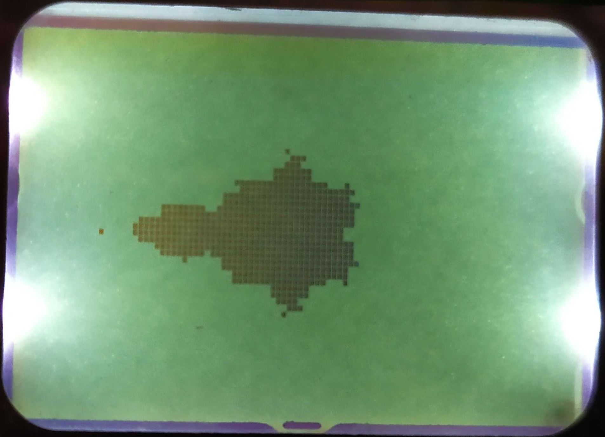

# avr-mandelbrot

A small, fractal-involving project created in AVR assembly

## Details

**MCU**: ATmega8 with 8 MHz internal RC clock  
**LCD**: 84x48 px screen with PCD8544 driver  
**Language**: Pure **AVR assembly**  
**Non-integer numbers**: 16-bit fixed-point, in 4.12 and 8.8 formats

## Build output

```
Used memory blocks:
   Data      :  Start = 0x0060, End = 0x0257, Length = 0x01F8
   Code      :  Start = 0x0000, End = 0x0206, Length = 0x0207

Assembly complete with no errors.
Segment usage:
   Code      :       519 words (1038 bytes)
   Data      :       504 bytes
   EEPROM    :         0 bytes
```

## Images


